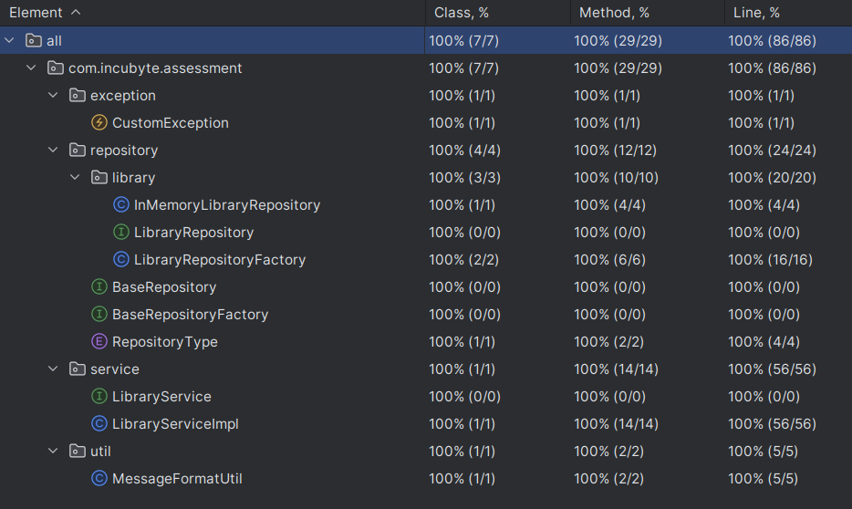

# Library Management System

### Description
A simple **Library Management System** with the following features:
- Add books to the library.
- Borrow books from the library.
- Return borrowed books.
- View a list of all available books.

This project focuses on clean, maintainable code while adhering to **Test-Driven Development (TDD)** principles, SOLID principles and clean code practices.

---

## Instructions for Running

### Prerequisites
- Java 17 or later
- JUnit 5
- Maven 3.6.3 or later

### Running the Application
- Clone the repository.
- Navigate to the root directory.
- Use the CLI class `LibraryManagementSystemCLI` to run the library management system.
- Follow menu-driven options for interacting with the system.

### Running Tests
- Option 1 : Execute `mvn clean test`
- Option 2 : Import [Run all tests with coverage](.run/Run%20all%20tests%20with%20coverage.run.xml) configuration in your IDE and run the tests.

---

## Test-Driven Development (TDD)
1.  Wrote failing test cases before implementing any functionality.
2. Incrementally developed the system while ensuring all tests pass.
3. Refactored for clean code and maintainability after passing tests.

### Test Coverage Report

## Implementation Details

### Design Patterns Used
1. **Factory Pattern**
    - The `LibraryRepositoryFactory` dynamically creates repository instances based on the provided repository type (e.g., IN_MEMORY, DATABASE, FILESYSTEM).

2. **Singleton Pattern**
    - The `LibraryRepositoryFactory` is implemented as a singleton to ensure consistent access to a single factory instance throughout the application.

3. **Dependency Injection**
    - The `LibraryServiceImpl` uses constructor-based dependency injection to decouple service logic from repository creation.

### Principles Followed
- **SOLID Principles.**
- **Clean Code Practices.**